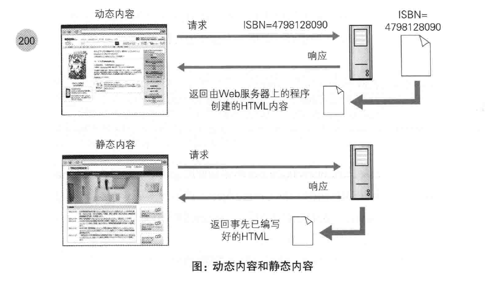

## 第十章 构建Web的技术

[TOC]

### 10.1 HTML

web页面是由HTML编写的，经过浏览器渲染之后，呈现给用户。

CSS样式表，赋予web页面丰富多彩的样式。

### 10.2 动态HTML

动态HTML主要依靠Javascript来改变HTML和CSS。DOM是JavaScript操作HTML的API。

### 10.3 Web应用

Web应用是通过Web提供服务的应用程序，得益于动态HTML的出现，web应用越来越流行。

CGI(Common Gateway Interface)：web服务器接收到客户端的请求后，转发给程序的一组机制。

Servlet：一种能在服务端创建动态内容的程序。

### 10.4 数据发布的格式和语言

XML：可以扩展的通用标记语言

JSON：以Javascript中的对象为基础的轻量级数据标记语言，它支持7种类型的数据：false/null/true/object/array/number/string，由于Ajax让json的使用更加广泛。